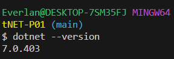
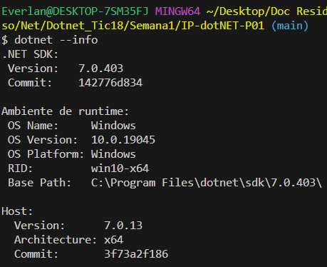

# Comandos basicos do DotNet

### Verificando se esta instalado.
#### Basta usar o comando 'dotnet' no seu terminal, caso não esteja instalado vai dar um erro informando que esse comando não é reconhecido, caso contrario segui a baixo um imagem demostrando o resultado.

### Verificando versão(ões) do dotnet.

#### Para ver essa informação pode usar o comando 'dotnet --version' ou caso queira mais informações use o comando 'dotnet --info'

* Usando o --version.

* Usando o --info

### Removendo o dotnet.
#### Obs.: Essa parte foi retirada do site 'https://learn.microsoft.com/pt-br/dotnet/core/additional-tools/uninstall-tool?tabs=windows'

#### 'dotnet-core-uninstall remove' desinstala os SDKs e os runtimes do .NET especificados por uma coleção de opções. As versões 1.2 e posteriores podem desinstalar os SDKs e os runtimes com a versão 5.0 ou anterior. As versões anteriores da ferramenta podem desinstalar a versão 3.1 e anteriores. Como essa ferramenta tem um comportamento destrutivo, é altamente recomendável que você faça uma execução DRY antes de executar o comando de remoção. A execução DRY mostrará quais SDKs e runtimes do .NET serão removidos quando você usar o comando remove.

### Atualizando o dotnet.
#### A partir do SDK do .NET 7, a sintaxe dotnet new foi alterada:
##### As opções --list, --search, --install e --uninstall se tornaram os subcomandos list, search, install e uninstall.
##### A opção --update-apply se tornou o subcomando update.
#### Para usar --update-check, use o subcomando update com a opção --check-only.

#### Exemplos da sintaxe antiga:

Verifique se há atualizações de pacotes de modelo instalados:

dotnet new --update-check.

Atualizar pacotes de modelo instalados:

dotnet new --update-apply.